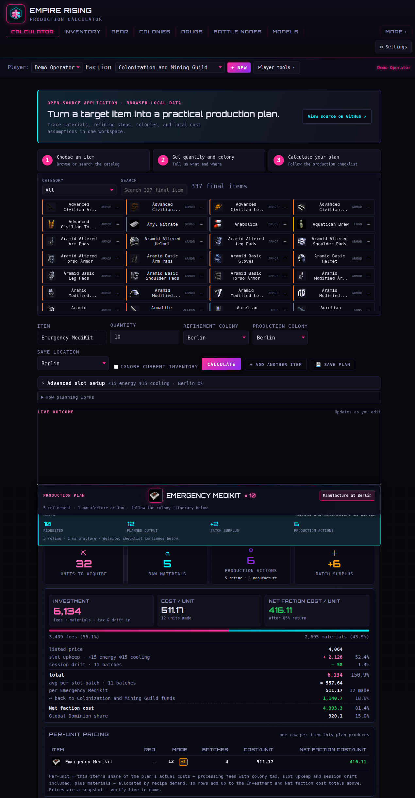
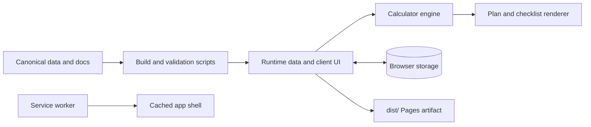

# Empire Rising Production Calculator

> A browser-local, offline-capable planner that turns an Empire Rising target item into a practical production route.

[**Open the live calculator →**](https://chrisfromnepa.github.io/production-calculator-ER/)

[](https://github.com/ChrisFromNEPA/production-calculator-ER/actions/workflows/ci.yml)
[](https://github.com/ChrisFromNEPA/production-calculator-ER/actions/workflows/codeql.yml)
[](https://github.com/ChrisFromNEPA/production-calculator-ER/actions/workflows/pages.yml)



> **Independent community project.** This project is not officially affiliated with, sponsored by, or endorsed by the Empire Rising development team or publisher.

Maintained under the public handle **ChrisFromNEPA** with community contributors.

## Why it exists

Production planning is a chain of decisions: which materials are needed, where they can be refined, what stock is already available, which colony should manufacture the final item, and how local assumptions affect the estimate. This project makes that chain visible instead of reducing it to a single unexplained number.

## Engineering highlights

- **Static client-side application:** the public shell is served as static files; Vite builds the optional React Three Fiber workbench used by the 3D surfaces.
- **Offline-first delivery:** `sw.js` precaches the application shell, uses network-first updates with cached fallback, and keeps large 3D/chart payloads lazy until the user requests them.
- **Browser-local data:** profiles, inventories, saved plans, preferences, and colony-world settings stay in browser storage unless the user explicitly exports them.
- **Portable workspace state:** versioned player/workspace exports are validated before import, with legacy inventory-only JSON support retained.
- **Responsive and accessible UI:** responsive layouts, mobile table containment, keyboard-operable controls, semantic regions, focus handling, and reduced-motion behavior are covered by source contracts and browser smoke tests.
- **Automated quality gates:** Node tests, production builds, asset-provenance checks, dependency auditing, Gitleaks, a clean-profile Chromium service-worker test, GitHub Actions, and CodeQL are part of the repository workflow.

## Architecture and data flow



The calculator reads reviewable source data from `data/`, uses the build scripts to generate runtime consumers, and renders plans in the browser. GitHub Pages receives only the staged `dist/` artifact. There is no production API or server-side workspace database. Optional models and charts are fetched only after an explicit interaction.

## Key features

- Builds single-item and multi-item production plans.
- Expands recipes into raw materials and intermediate production steps.
- Accounts for the inventory already attached to the active player profile.
- Compares available refinement paths when price data is available.
- Separates estimated player investment from faction return and net faction cost.
- Stores profiles, inventory, plans, preferences, and colony assumptions in the browser.
- Exports and imports portable workspace backups.
- Remains usable offline after the application has been loaded successfully.
- Includes reference tools for drugs, battle nodes, colonies, models, the item catalog, character assets, and community notes.

No account, password, API key, shared guild database, or installation is required to use the public site.

## Quick orientation

This is a **browser-local production planner for Empire Rising**. It is useful
when you want to answer one of these questions quickly:

- What do I need to obtain, refine, and manufacture to make an item?
- How much of a material do I already have at a specific colony or storage zone?
- Which refinement path or production colony is cheaper under my assumptions?
- What does a gear, medikit, booster, ammo item, or food plan require?

The normal player path is:

1. Create a local player profile.
2. Choose a faction for economic context, or leave it **Unaffiliated**.
3. Record the inventory you actually own.
4. Choose a final item and quantity.
5. Select production/refinement colonies and calculate.
6. Work through the obtain, move, refine, and manufacture steps.

The calculator does not require an account and does not infer ownership,
inventory, recipes, or rebates from faction membership.

### Inventory at a glance

The **Inventory** tab is a two-step stock ledger:

1. Choose the storage colony or zone.
2. Add stock to that location using the item browser.

The add-stock browser provides focused tabs for **Mined + refined** materials,
**Mineable** items, **Medikits**, **Ammo**, **Boosters / drugs**, **Food**, and
**All items**. On large monitors the mined/refined set expands into a full
grid; on phones it remains a compact, internally scrollable picker. Selecting
an item or adding a stack preserves the page position so repeated stocking is
fast. **Workspace View** below the ledger summarizes totals across every zone
and supports filtering, materials-only mode, and screenshot scanning.

### What the numbers mean

- **Estimated investment** is the gross player spend under the selected prices,
  path, destination, taxes, transport, and inventory assumptions.
- **Faction return** is modeled colony-owner income, not an automatic personal
  discount.
- **Net faction cost** is a planning figure after the modeled return.
- **Cost per unit** spreads the plan investment across the requested output.

Important values are dated snapshots and local assumptions, not live market or
ownership feeds.

## Usage

1. Open the [live calculator](https://chrisfromnepa.github.io/production-calculator-ER/).
2. Enter your character name and choose a faction, or leave the profile **Unaffiliated**.
3. Select **Create player and start**.
4. Search for the item you want to produce.
5. Set the quantity, destination colony, and any relevant production options.
6. Select **Calculate**.
7. Read **Plan at a glance** first:
   - material units to obtain;
   - number of production steps;
   - estimated investment;
   - the recommended order of work.
8. Open **Detailed costs, batches, and per-unit pricing** when you need the expert-level breakdown.

Your faction selection provides economic context; it does **not** hide or unlock recipes. A new profile never receives invented inventory, colony ownership, or rebates.

## Understanding the result

The result distinguishes several figures that answer different questions:

- **Estimated investment** — the gross amount the player is expected to spend under the selected prices, production path, destination, taxes, transport, and inventory assumptions.
- **Cost per unit** — the plan's investment allocated across the requested output quantity.
- **Faction return** — 85% of mining/production spend before tax returns to the colony owner when the selected faction owns the relevant colony in your local world-state settings.
- **Net faction cost** — gross investment after the applicable faction return. This is a faction planning metric, not automatically a personal discount.

The remaining 15% is Global Dominion income. The calculator shows an explicitly assumed 50/50 allocation to FDC and LED (7.5% each). Unknown ownership fails safely to **no faction return**. Use **Unaffiliated** when you want a straightforward gross-cost plan without subtracting owner income.

For the complete rules, see [Factions and economics](docs/factions-and-economics.md).

## Main areas

| Area | Purpose |
| --- | --- |
| **Calculator** | Choose targets, configure quantity and destination, and build production plans. |
| **Inventory** | Choose a colony/zone, add mined/refined materials or other stock, review per-zone quantities, and scan/filter the all-zones workspace. |
| **Gear** | Assemble an armor/booster loadout, review its stats, and send required pieces to the calculator. |
| **Colonies** | Maintain local colony ownership and tax assumptions; export or import a reproducible world snapshot. |
| **Drugs** | Browse drug reference data. |
| **Battle Nodes** | Review battle-node and map reference data. |
| **Models** | Open the 3D model gallery, Character Studio, and Item Catalog from one tab. Optional model files load only when requested. |
| **Community Notes** | Read public community reference notes included with the project. |

The compact navigation may place less frequently used areas under **More**, especially on phones. **Character Studio** and **Item Catalog** are subtabs inside **Models**, not separate top-level routes.

## Profiles, inventory, and workspace backups

Data belongs to the current browser profile unless you export it.

- A **player profile** keeps its own faction and inventory.
- Changing a player's faction does not alter that player's inventory.
- **Export player** creates a player-focused backup.
- **Export workspace** creates the broadest supported local backup, including profiles, inventory, plans, preferences, and colony-world context.
- **Import workspace** validates a supported snapshot before replacing local state.
- Legacy inventory-only JSON imports remain supported.

Use **Player tools** for player and workspace import/export actions. Keep a recent workspace export if the data matters to you, especially before clearing browser data, changing browsers, or moving to another device.

Workspace files may contain character names, inventory, notes, and economic assumptions. Review and sanitize an export before posting it publicly or attaching it to an issue.

## Themes and accessibility

Open **Settings** to choose a theme, sound behavior, and text size.

General themes:

- Auto / system
- Dark
- Light
- Trans Pride
- Rainbow Pride

Optional faction palettes:

- Law Enforcement Department
- Freedom Defense Corps.
- Guardians of Mankind
- Brotherhood of Shadows
- Mercenaries of the Blood
- Colonization and Mining Guild
- EuroCore
- Vortex, Inc.

Faction palettes are visual presets only. They do not change the active player faction, recipes, ownership, prices, or calculations.

Rainbow Pride uses a restrained dark base with rainbow identity accents rather than rainbow-filled cards and controls. Motion is reduced when the browser or operating system requests reduced motion. Keyboard focus, semantic regions, and readable text contrast are treated as release requirements; accessibility issue reports are welcome.

## Sound behavior

Sound is **Off by default** and remains user-controlled. Settings offers:

- **Off** — no routine navigation audio.
- **UI cues only** — short interface cues for tab changes.
- **Terminal voices** — contextual terminal voice clips for supported areas.

A browser may require a click or key press before it permits audio. Selecting a sound mode does not bypass browser autoplay restrictions. Sound and theme preferences are saved locally.

## Offline use and updates

The calculator is a static Progressive Web App hosted on GitHub Pages. After a successful online load, its service worker caches the application shell for offline fallback. No live server is required for calculations.

Important boundaries:

- Offline availability depends on the browser having cached the necessary assets.
- Large optional 3D model files are loaded on demand rather than all being precached.
- Market prices, colony ownership, taxes, transport assumptions, and faction context are not live feeds.
- Local data does not synchronize automatically between browsers or devices.

If the site appears stuck on an old release:

1. Reconnect to the network.
2. Reload the page.
3. If necessary, perform a hard refresh or close and reopen the tab so the new service worker can activate.
4. Your stored workspace should remain local, but keeping an export is still recommended.

See [Known limitations](docs/known-limitations.md) for the complete boundary list.

## Privacy and data storage

The public application has no login, shared guild database, remote analytics endpoint, Cloudflare Worker dependency, or GitHub-token requirement.

Profiles, inventory, saved plans, preferences, and world-state settings remain in browser storage unless you explicitly export or share them. The browser still requests public application assets—and optional model files when selected—from the public deployment, so “local-first” does not mean “no network requests during initial loading.”

Never put passwords, tokens, private URLs, connection strings, or private player information in an issue or committed workspace fixture.

## Known limitations and roadmap

The project contains community-maintained game data and assumptions. Values can become incomplete or outdated as Empire Rising changes.

### Roadmap

- Keep canonical balance snapshots, provenance, and generated runtime consumers synchronized as source data changes.
- Extend clean-profile browser coverage for deeper interactive flows and assistive-technology traversal when the required harness is available.
- Continue the opt-in 3D workbench migration without making optional model payloads part of the default offline shell.

### Authoritative combat-stat source

Combat and item stats use the published **[ER - Balance Sheet](https://docs.google.com/spreadsheets/d/e/2PACX-1vT_DqXbgxfJmrzLJvFov-iqiRwPeSDpaqk_r3fVqfn7-8bfjAgT2ZWfQLiM_D41thtJE-LO5CtHWt50/pubhtml?gid=29503079&single=true)** tab (`gid=29503079`) as the authoritative reference. The published HTML URL is recorded in `data/balance_stats.json`; the update command fetches its machine-readable CSV export, validates duplicate rows, writes the canonical snapshot, and regenerates the recipe/runtime consumers.

To refresh the stats from that source:

```bash
npm run stats:update
```

The calculator still displays a dated snapshot rather than claiming live synchronization. Verify important values against the published sheet and the live game.

When reporting a data problem, include:

- the item, recipe, colony, or faction involved;
- the value shown by the calculator;
- the value you expected;
- a public source or sanitized in-game evidence;
- the date the value was checked;
- a minimal reproduction when calculation behavior is involved.

Canonical source data and generated runtime files must remain synchronized. Contributors should edit source data and generation scripts rather than hand-editing generated JavaScript.

Useful references:

- [Public player guide](docs/public-player-guide.md)
- [Factions and economics](docs/factions-and-economics.md)
- [Known limitations](docs/known-limitations.md)
- [Asset provenance](docs/asset-provenance.md)
- [Release QA](docs/release-qa.md)
- [Contributing](CONTRIBUTING.md)

## Install and run

### Requirements

- Node.js 22 LTS or newer
- npm 10 or newer

### Install and run

```bash
git clone https://github.com/ChrisFromNEPA/production-calculator-ER.git
cd production-calculator-ER
npm ci
npm run local:host
```

Open <http://localhost:4173/> on the development machine. From another
machine on the trusted LAN, use `http://<linux-lan-ip>:4173/` instead. Serving
the repository over HTTP is preferable to opening `index.html` directly because
service workers, modules, and asset paths follow browser origin rules.

### Long-running LAN development server

For live-edit work across a private home LAN, use the Vite server instead of committing every change to GitHub:

```bash
npm run local:host
```

It serves the working tree on port `4173` on all local interfaces. From a Windows machine on the same LAN, open `http://<linux-lan-ip>:4173/`; use `hostname -I` on Linux to find the address. The restartable user-service setup and LAN safety boundary are documented in [Local hosting](docs/local-hosting.md). Do **not** expose this unauthenticated development server to the public internet.

## Verification

Run the normal release gate:

```bash
npm run check
```

That command runs the complete Node test suite and creates the production Pages artifact in `dist/`.

Additional focused gates:

```bash
npm run test:3d        # build and verify the optional React Three Fiber bundle
npm run test:budgets   # verify 3D size and performance contracts
npm run test:browser-ux # real Chromium smoke coverage at desktop and mobile widths
npm run test:sw-update # clean-profile browser test of the service-worker update lifecycle
npm run assets:check   # enforce recorded provenance for shipped binary assets
npm run assets:report  # inspect the asset inventory without enforcing the gate
```

`test:sw-update` launches a headless Chromium build with a fresh temporary
profile (never a shared/stale one) and drives the trust-indicator update flow
over the DevTools Protocol: first install keeps the update chip hidden, a
changed service worker exposes it, Reload applies the new worker, and an
offline reload still renders the shell from cache. It needs a Chromium binary —
set `CHROMIUM_BIN`, or install Playwright's Chromium under
`~/.cache/ms-playwright` (this project has no browser-automation dependency).

The main scripts are:

| Command | Result |
| --- | --- |
| `npm test` | Runs all `tests/*.test.mjs` contracts. |
| `npm run build:3d` | Builds the lazy optional 3D workbench. |
| `npm run build:pages` | Builds 3D assets and stages the GitHub Pages artifact in `dist/`. |
| `npm run build` | Alias for the Pages build. |
| `npm run check` | Runs tests and the complete production build. |
| `npm run local:host` | Serves the editable working tree on LAN port 4173 for live local development. |

There is currently no standalone `lint` script in `package.json`; `npm run check` is the repository's combined test, production-build, and served-shell quality gate.

## Project structure

| Path | Purpose |
| --- | --- |
| `index.html` | Static application shell and public view markup. |
| `src/app-core.js` | Shared navigation, themes, audio, plan rendering, and application helpers. |
| `src/app-init.js` | Startup and DOM event wiring. |
| `src/views/` | Player, inventory, colonies, models, and other public view modules. |
| `src/styles.css` and `src/styles/` | Theme, shell, component, responsive, and view styling. |
| `data/` | Canonical human-reviewable game and faction data. |
| `scripts/` | Data generation, asset validation, and Pages build tooling. |
| `tests/` | Node-based calculation, data, accessibility, navigation, storage, and deployment contracts. |
| `docs/` | Player guidance, methodology, provenance, audits, and release QA. |
| `sw.js` | Offline shell and runtime caching behavior. |
| `dist/` | Generated Pages artifact; do not use it as the source of truth. |

## Contributing

Focused bug fixes, data corrections, documentation improvements, accessibility fixes, and reproducible browser reports are welcome.

Before opening a pull request:

1. Read [CONTRIBUTING.md](CONTRIBUTING.md).
2. Keep the change focused.
3. Include provenance and a verification date for data corrections.
4. Run `npm run check` and any relevant focused gates.
5. Include screenshots or browser verification notes for visible UI changes.
6. Never commit credentials, private inventories, Discord exports, or personal information.

Issues: <https://github.com/ChrisFromNEPA/production-calculator-ER/issues>

## Deployment

GitHub Actions builds the public artifact from a clean checkout and deploys only the staged `dist/` output to GitHub Pages. The production site tracks `main`:

<https://chrisfromnepa.github.io/production-calculator-ER/>

A release is not considered verified merely because a push succeeded. The exact commit must pass CI and CodeQL, complete the Pages deployment, and be checked on the live site. Deployment evidence is maintained in [docs/release-qa.md](docs/release-qa.md).

## Contributing, license, and disclaimer

Contributions should preserve the local-first boundary and include reproducible verification. See [CONTRIBUTING.md](CONTRIBUTING.md) for the focused-change, data-provenance, privacy, and testing expectations.

This is an independent community project and is not officially affiliated with, sponsored by, or endorsed by the Empire Rising development team or publisher.

Original calculator code is released under the [MIT License](LICENSE).

Empire Rising names, game data, and extracted assets remain subject to separate rights and are **not** automatically covered by the software license. Project-owner approval to include an asset does not relicense that asset. Read [DISCLAIMER.md](DISCLAIMER.md) and [docs/asset-provenance.md](docs/asset-provenance.md) before redistributing game-derived content.
