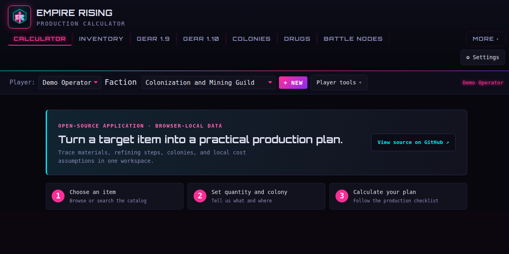
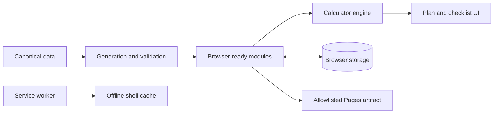

# Empire Rising Production Calculator

A browser-local production planner for Empire Rising. Choose an item and get the materials, locations, costs, and steps needed to make it.

[Open the live calculator](https://chrisfromnepa.github.io/production-calculator-ER/) · [View the latest release](https://github.com/ChrisFromNEPA/production-calculator-ER/releases/latest) · [Report an issue](https://github.com/ChrisFromNEPA/production-calculator-ER/issues)

[](https://github.com/ChrisFromNEPA/production-calculator-ER/actions/workflows/ci.yml)
[](https://github.com/ChrisFromNEPA/production-calculator-ER/actions/workflows/codeql.yml)
[](https://github.com/ChrisFromNEPA/production-calculator-ER/actions/workflows/pages.yml)



*Example workspace with fictional player data. Prices, ownership, taxes, and recipes are dated planning inputs rather than live game feeds.*

> Independent community project. This repository is not affiliated with, sponsored by, or endorsed by the Empire Rising development team or publisher.

## What it does

- Builds single-item and multi-item production plans.
- Expands recipes into raw materials, intermediate products, and ordered work steps.
- Accounts for inventory stored at specific colonies or zones.
- Compares refinement paths when price data is available.
- Separates gross player investment, modeled colony-owner return, and net faction cost.
- Supports gear planning and reference views for drugs, colonies, battle nodes, and community notes.
- Saves profiles, inventories, plans, preferences, and local world assumptions in the browser.
- Exports and validates portable workspace backups.
- Remains available after the application shell has been cached for offline use.

There is no account, shared inventory database, production API, or automatic browser sync. The public app sends no workspace data to a project backend because there is no project backend. Exported workspaces can contain player names and planning assumptions, so review them before sharing.

## How to use it

1. Open the [live calculator](https://chrisfromnepa.github.io/production-calculator-ER/).
2. Create a local player profile and choose a faction, or select **Unaffiliated**.
3. Add the inventory you own and its storage location.
4. Choose an item, quantity, production colony, and relevant options.
5. Select **Calculate**.
6. Follow the generated obtain, move, refine, and manufacture steps.
7. Export the workspace when you need a portable backup.

Faction selection supplies economic context. It does not unlock recipes or invent inventory, ownership, or rebates. If colony ownership is unknown, the calculator applies no faction return.

### Reading a result

| Figure | Meaning |
| --- | --- |
| Estimated investment | Gross planned spend under the selected inventory, path, destination, price, tax, and transport assumptions |
| Cost per unit | Planned investment allocated across requested output |
| Faction return | Modeled colony-owner income when local ownership assumptions support it |
| Net faction cost | Gross investment after the modeled faction return |

The detailed formulas and assumptions are documented in [Factions and economics](docs/factions-and-economics.md).

## Technical overview

The project is a static client application built with Vite and plain JavaScript. Canonical JSON and spreadsheet inputs live under `data/`, `costs/`, and `stats/`; Node and Python scripts validate and transform them into browser-ready modules. Calculation, rendering, profiles, and workspace state all run client-side.



A positive allowlist builds the GitHub Pages artifact instead of copying the repository wholesale. The service worker caches the application shell and keeps the optional chart payload lazy. Historical model and extraction workspaces remain available in the v1.4.1 tag and Git history, but no longer clutter the current checkout or deployment.

The repository's engineering controls include:

- deterministic Node and Python tests;
- generated-data drift checks;
- static JavaScript and accessibility checks;
- module-scoped V8 coverage thresholds;
- fail-closed Chromium UX and service-worker lifecycle tests;
- responsive checks across phones, tablets, 720p, 1080p, 2K, and 4K layouts;
- dependency, secret, asset-provenance, binary-growth, and Pages-artifact gates;
- GitHub Actions CI, CodeQL scanning, and workflow-based Pages deployment.

Automated accessibility checks cover markup, navigation, labels, image alternatives, ARIA references, focus behavior, contrast rules, forced colors, and reduced motion. Manual screen-reader traversal remains a human QA boundary.

## Local development

Requirements: Node.js 22+ and npm 10+.

```bash
git clone https://github.com/ChrisFromNEPA/production-calculator-ER.git
cd production-calculator-ER
npm ci
npm run local:host
```

Open <http://localhost:4173/>. For trusted-LAN hosting and persistent local service setup, see [Local hosting](docs/local-hosting.md).

## Verification

Run the deterministic project gate:

```bash
npm run check
```

It runs the Node and Python suites, source-quality and accessibility checks, generated-data validation, the production build, baseline guards, and coverage checks.

Run the real-browser suites separately:

```bash
npm run test:browser-ux
npm run test:sw-update
```

Release-specific test totals, workflow runs, artifact measurements, and live-site checks are recorded in [Release QA](docs/release-qa.md). The [v1.4.2 responsive QA report](docs/responsive-qa-2026-09-03.md) documents the display, theme, and text-scale matrix used for this release.

## Project documentation

The [documentation index](docs/README.md) groups player guidance, architecture and data notes, contributor information, quality gates, and release evidence by audience.

Useful starting points:

- [Player guide](docs/public-player-guide.md)
- [Known limitations](docs/known-limitations.md)
- [Factions and economics](docs/factions-and-economics.md)
- [Quality gates](docs/quality-gates.md)
- [Asset provenance](docs/asset-provenance.md)
- [Changelog](CHANGELOG.md)

## Contributing

Bug fixes, data corrections, documentation improvements, accessibility fixes, and reproducible browser reports are welcome. Read [CONTRIBUTING.md](CONTRIBUTING.md) before opening a pull request.

Please include provenance and a verification date for data corrections. Never commit credentials, private inventories, Discord exports, or personal data.

## License and attribution

Original calculator code is released under the [MIT License](LICENSE). Empire Rising names, game data, maps, icons, textures, and audio may have separate rights. See [DISCLAIMER.md](DISCLAIMER.md) and [Asset provenance](docs/asset-provenance.md).

Maintained under the public handle **ChrisFromNEPA** with community contributors.
